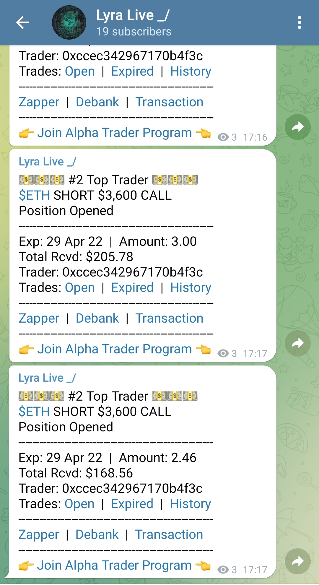

# Lyra Bot \_/

A bot providing real time trade data to twitter, discord and telegram.

## Goal

Provide real-time trade information via integrations with popular comms dapps.



## Overview

### MVP

- Replicate current Lyra Live Twitter bot functionality.
- Listen for new trades that meet specific criteria.
- Posts trades to Discord / Twitter and Telegram.

## Proposed Tech Stack

- Next.js
- React

## Development

Todo

### Install dependencies

```bash
yarn install
```

### Resources

- [Lyra Finance Core NPM Package](https://www.npmjs.com/package/@lyrafinance/protocol)
- [Lyra Finance Repositories](https://github.com/lyra-finance)

## Contributing

Lyra grantsDao welcomes contributors. Regardless of the time you have available, everyone can provide meaningful contributions to the project by submitting bug reports, feature requests or even the smallest of fixes! To submit your contribution, please fork, fix, commit and create a pull-request describing your work in detail. For more details, please have a look at the [Contribution guidelines](https://github.com/Lyra-Grants/docs/blob/main/CONTRIBUTING.md).

## Contact

Join the community on the [Lyra Discord server](https://https://discord.gg/lyra)!
